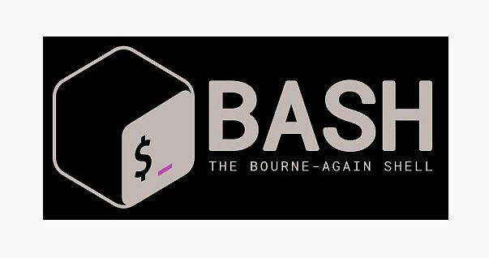

# Bash-Sripting From Zero 🚀



This repository documents my journey of learning **Bash scripting from scratch**.  
It contains topic-wise notes, hands-on script examples, weekend learning logs, and challenge solutions — starting from the very basics and moving toward advanced Bash scripting.  

---

## 📂 Repository Structure
- **`scripts/`** → All the Bash scripts I write while learning  
- **`notes/`** → Markdown notes for each topic  
- **`challenges/`** → Challenge problems and their solutions  
- **`journal/`** → Weekly logs of what I learned and uploaded  

---

## Phase 0 — Basics
| Topic | Focus |
|---|---|
| Bash Basics | Shell vs terminal, interactive vs scripts |
| Running Scripts | shebang, chmod, execution |
| Exit Codes | `$?`, success vs failure |
| Help System | `man`, `help`, `type` |

---

## Phase 1 — Variables & Expansion
| Topic | Focus |
|---|---|
| Variables | Assignment, naming rules |
| Expansion | `$var`, `${var}` |
| Special Variables | `$0`, `$1..$9`, `$@`, `$#`, `$$`, `$?` |
| Environment Vars | `export`, env scope |
| Command Substitution | `$(command)` |
| Arithmetic | `$(( ))` |

---

## Phase 2 — Quoting & Word Splitting
| Topic | Focus |
|---|---|
| No Quotes | Word splitting, globbing |
| Double Quotes | Safe expansion |
| Single Quotes | Literal strings |
| Escaping | `\` usage |
| IFS | Loop safety |
| Globbing | `* ? []` |

---

## Phase 3 — Input / Output
| Topic | Focus |
|---|---|
| STDIN / STDOUT / STDERR | Streams |
| Redirection | `> >> < 2>` |
| Pipes | Data flow |
| Here-Docs / Strings | Multi-line input |

---

## Phase 4 — Conditions
| Topic | Focus |
|---|---|
| test / `[ ]` | POSIX tests |
| `[[ ]]` | Safer Bash tests |
| File Tests | `-f -d -x` |
| String & Numeric Tests | Comparisons |
| Exit Code Logic | `if command; then` |

---

## Phase 5 — Control Structures
| Topic | Focus |
|---|---|
| if / elif / else | Decision logic |
| case | Pattern matching |
| Loops | for, while, until |
| Loop Control | break, continue |

---

## Phase 6 — Functions & Structure
| Topic | Focus |
|---|---|
| Functions | Reusability |
| Local Variables | Scope |
| Return vs echo | Data handling |
| Script Layout | Clean structure |
| Sourcing | Modular scripts |

---

## Phase 7 — Arguments & Options
| Topic | Focus |
|---|---|
| Positional Params | `$1`, `$@` |
| shift | Argument parsing |
| getopts | Flags |
| Usage Messages | CLI UX |
| Validation | Safe input |

---

## Phase 8 — Error Handling & Safety
| Topic | Focus |
|---|---|
| set -e | Exit on error |
| set -u | Undefined vars |
| pipefail | Pipeline safety |
| trap | Cleanup |
| Signals | SIGINT, SIGTERM |

---

## Phase 9 — Text Processing
| Tool | Purpose |
|---|---|
| grep | Search |
| sed | Transform |
| awk | Structured text |
| cut / sort / uniq | Pipelines |
| Regex | Pattern matching |

---

## Phase 10 — Advanced Bash
| Topic | Focus |
|---|---|
| Arrays | Indexed & associative |
| Subshells | `( )` vs `{ }` |
| Process Substitution | `<( )` |
| Job Control | Background tasks |
| Performance | Fewer forks |

---

## Phase 11 — Professional Practices
| Topic | Focus |
|---|---|
| shellcheck | Linting |
| Style Guide | Consistency |
| Portability | POSIX vs Bash |
| Logging | Debugging |
| Git | Version control |

---

**Goal:** Write safe, readable, maintainable Bash scripts used in real systems.

---

## ⚡ How to Run Scripts
Clone this repository and run any script:

```bash
git clone https://github.com/Redinit/bash-from-zero.git
cd bash-from-zero/scripts
chmod +x scriptname.sh
./scriptname.sh

